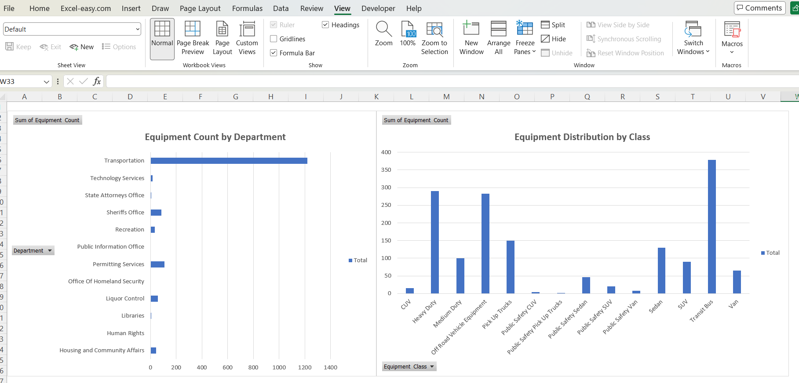

### Fleet Equipment Dashboard

Project Overview
This project presents an interactive dashboard created using Microsoft Excel to analyze fleet equipment data across different departments and equipment classes.

Dataset
The dataset contains information about fleet equipment, including department names, equipment classes, and total equipment count.

Tools Used
- Microsoft Excel  
- Pivot Tables  
- Pivot Charts

Visualizations
- Equipment Count by Department (Column Chart)  
- Equipment Distribution by Class (Bar Chart)

### Dashboard Preview

Key Insights
- Tranportation has the highest equipment count  
- Office Of Homeland Security and Public Information Office has the lowest equipment count  
- Equipment distribution is uneven across departments
- A few equipment classes make up the majority of the inventory like Transit Bus.
